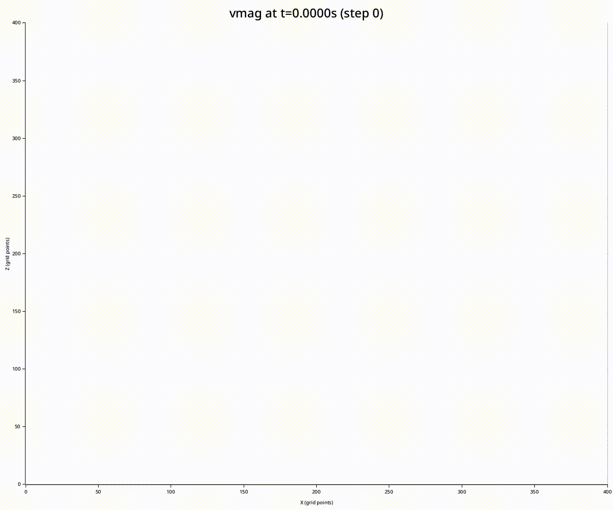

# Seismic wave forward modeller

## Todos

- Take input files
- More boundary conditions
- Command line tools

## Theory

Grid cell layout:

~~~
σxx,σzz ----vx---- σxx,σzz ----vx---- σxx,σzz
   |                 |                 |
   |                 |                 |
   vz      σxz      vz      σxz      vz
   |                 |                 |
   |                 |                 |
σxx,σzz ----vx---- σxx,σzz ----vx---- σxx,σzz
   |                 |                 |
   |                 |                 |
   vz      σxz      vz      σxz      vz
   |                 |                 |
   |                 |                 |
σxx,σzz ----vx---- σxx,σzz ----vx---- σxx,σzz
~~~

For arrays:

- `vx[i][k]` - represents velocity at position (i+½, k) physically
- `vz[i][k]` - represents velocity at position (i, k+½) physically
- `sigma_xx[i][k]` - represents stress at position (i, k) physically
- `sigma_zz[i][k]` - represents stress at position (i, k) physically
- `sigma_xz[i][k]` - represents stress at position (i+½, k+½) physically

### Equations

Velocity Updates (from Momentum Equation)

$$\frac{\partial v_x}{\partial t} = \frac{1}{\rho} \left[ \frac{\partial \sigma_{xx}}{\partial x} + \frac{\partial \sigma_{xz}}{\partial z} \right]$$

$$\frac{\partial v_z}{\partial t} = \frac{1}{\rho} \left[ \frac{\partial \sigma_{xz}}{\partial x} + \frac{\partial \sigma_{zz}}{\partial z} \right]$$

Stress Updates (from Constitutive Relation)

$$\frac{\partial \sigma_{xx}}{\partial t} = (\lambda + 2\mu) \frac{\partial v_x}{\partial x} + \lambda \frac{\partial v_z}{\partial z}$$

$$\frac{\partial \sigma_{zz}}{\partial t} = \lambda \frac{\partial v_x}{\partial x} + (\lambda + 2\mu) \frac{\partial v_z}{\partial z}$$

$$\frac{\partial \sigma_{xz}}{\partial t} = \mu \left[ \frac{\partial v_x}{\partial z} + \frac{\partial v_z}{\partial x} \right]$$

### Discretization

- Velocities at time n+0.5

- Update stresses to time n+1 using velocities at n+0.5

- Update velocities to time n+1.5 using stresses at n+1

### Material Properties

Store material properties at the same locations as normal stresses (i, k)

Use harmonic averaging for properties at velocity and shear stress locations.

Harmonic mean: 2ab/(a+b)

### Boundary Conditions

- Rigid (starting implementation)
  - Velocities are zero at the edges
  - Causes reflections
- Damping
  - Add a "sponge layer" around the edges (maybe 20-50 grid points thick)
  - Gradually decrease velocities and stresses to zero in this layer
- Free surface
  - Particles can move freely
  - Normal stress components (σxz, σzz) are zero at the surface
